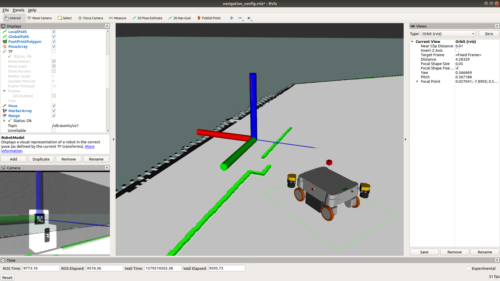

# neo_charger

## Package for automatic navigation to charging station.

  

Example setup with our [Simulation](https://github.com/neobotix/neo_charger).

Please find our documentations [here](https://docs.neobotix.de/display/TUT/Using).